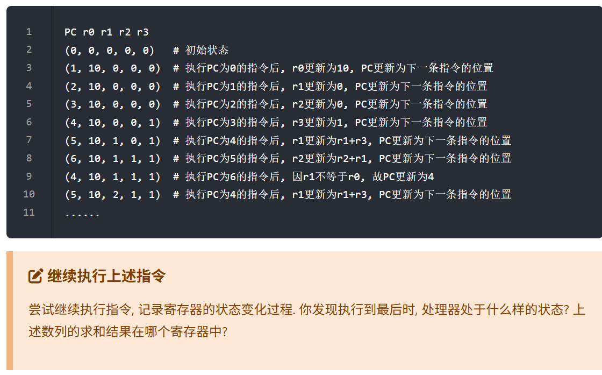
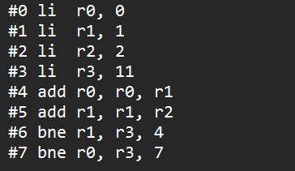
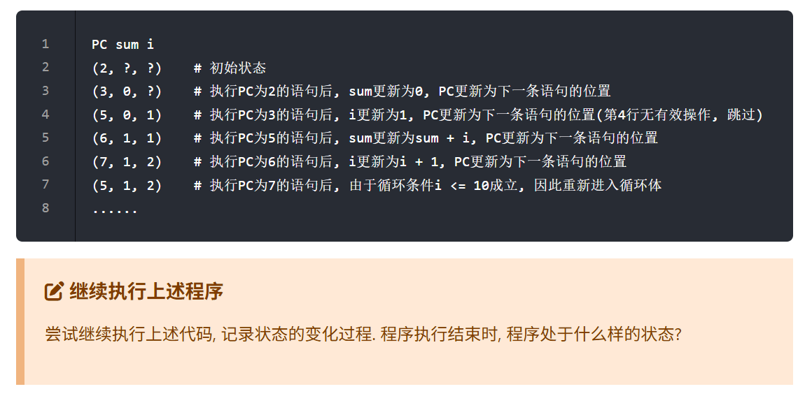
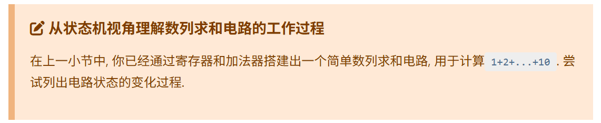
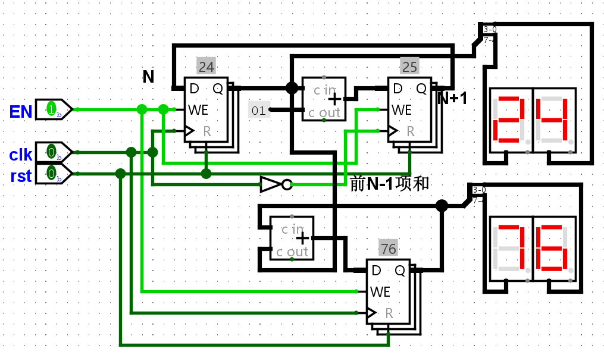

处于指令7死循环状态，求和结果存在r3寄存器  

***

寄存器状态表

| pc   | r0   | r1   | r2   | r3   |
| ---- | ---- | ---- | ---- | ---- |
| 0    | 0    | 0    | 0    | 0    |
| 1    | 0    | 0    | 0    | 0    |
| 2    | 0    | 1    | 0    | 0    |
| 3    | 0    | 1    | 2    | 0    |
| 4    | 0    | 1    | 2    | 11   |
| 5    | 1    | 1    | 2    | 11   |
| 6    | 1    | 3    | 2    | 11   |
| 4    | 1    | 3    | 2    | 11   |
| 5    | 4    | 3    | 2    | 11   |
| 6    | 4    | 5    | 2    | 11   |
| 4    | 4    | 5    | 2    | 11   |
| 5    | 9    | 5    | 2    | 11   |
| 6    | 9    | 7    | 2    | 11   |
| 4    | 9    | 7    | 2    | 11   |
| 5    | 16   | 7    | 2    | 11   |
| 6    | 16   | 9    | 2    | 11   |
| 4    | 16   | 9    | 2    | 11   |
| 5    | 25   | 9    | 2    | 11   |
| 6    | 25   | 11   | 2    | 11   |
| 7    | 25   | 11   | 2    | 11   |

1+3+5+7+9 = 25  

***

处在(9,55,11)状态

***

| R1(N) | R2(N+1) | R3(sum N) |
| ----- | ------- | --------- |
| 0     | 1       | 0         |
| 1     | 2       | 1         |
| 2     | 3       | 3         |
| 3     | 4       | 6         |
| 4     | 5       | 10        |
| 5     | 6       | 15        |
| 6     | 7       | 21        |
| 7     | 8       | 28        |
| 8     | 9       | 36        |
| 9     | 10      | 45        |
| 10    | 11      | 55        |

