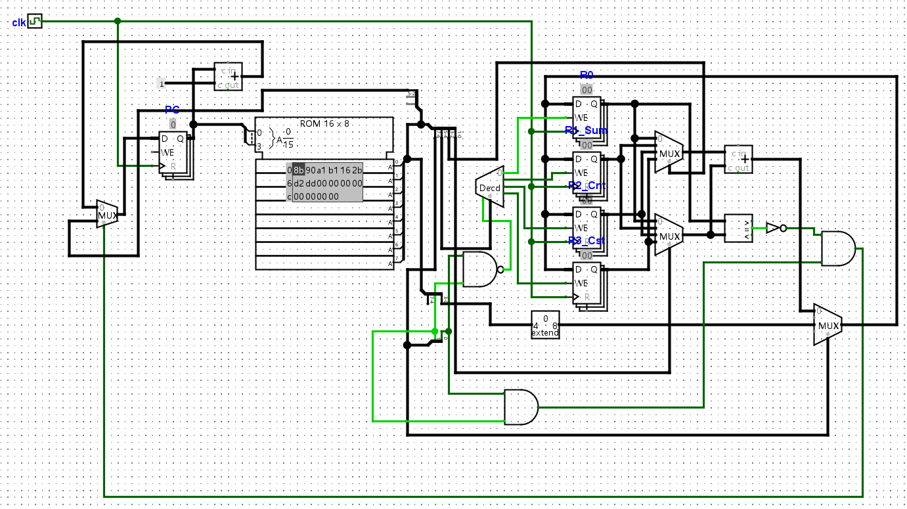
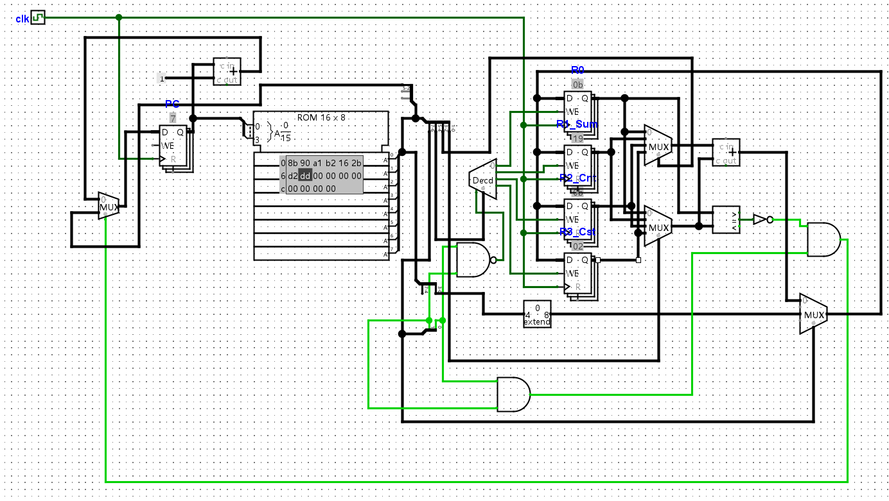
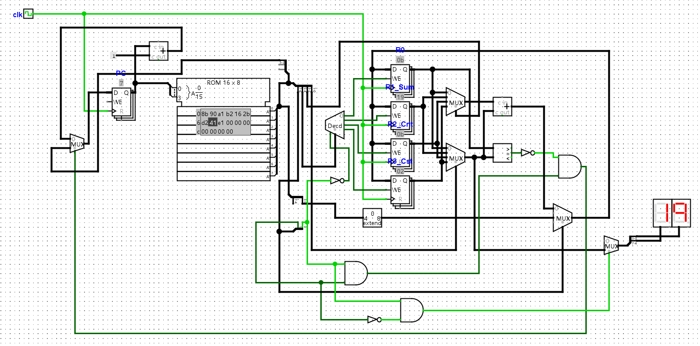

# **1~10数列求和**



机器码：

8b 90 a1 b1 16 2b d2 dd

10001011 10010000 10100001 10110001 00010110 00101011 11010010 11011101

| 指令编号 | 汇编指令     |
| -------- | ------------ |
| 0        | li r0 $11    |
| 1        | li r1 $0     |
| 2        | li r2 $1     |
| 3        | li r3 $1     |
| 4        | add r1 r1 r2 |
| 5        | add r2 r2 r3 |
| 6        | bner0 4 r2   |
| 7        | benr0 7 r1   |

# **10以内奇数求和**

| 指令编号 | 汇编指令         |
| -------- | ---------------- |
| 0        | li r0 $11        |
| 1        | li r1 $0         |
| 2        | li r2 $1         |
| 3        | li r3 $2 //改为2 |
| 4        | add r1 r1 r2     |
| 5        | add r2 r2 r3     |
| 6        | bner0 4 r2       |
| 7        | benr0 7 r1       |

机器码：

8b 90 a1 b2 16 2b d2 dd

10001011 10010000 10100001 10110010 00010110 00101011 11010010 11011101


结果为25

# **添加新指令`out rs`**

out rs格式为

```
 7  6 5  4 3   2 1   0
+----+----+-----+-----+
| 01 |    xx    | rs  | 数码管显示rs
```

加入 01000001 41 指令7:out r1，原指令7修改为跳转至8处，放置在指令8，显示求和结果 

11100001 E1 指令8:bner0 8

