A B

0 0 P1、P2通，N1、N2断	Y 1

0 1 P1、N1、N2通，P2断	Y 0

1 0 P2通，N1、N2、P1断	Y 0

1 1 N1、N2通，P1、P2断	Y 0

或非门

在上一题的电路基础上加上非门即可

左图需要6+6+2=14个晶体管，右图需要6个晶体管

需要6+4+4=14个晶体管

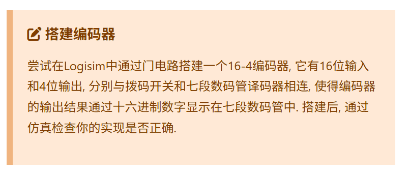

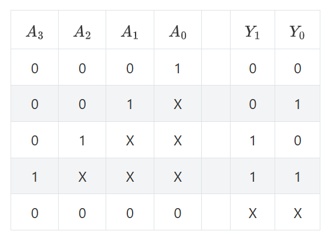

Y1 = A3 | A2	Y0 = A3 | (~A2 & A1)  

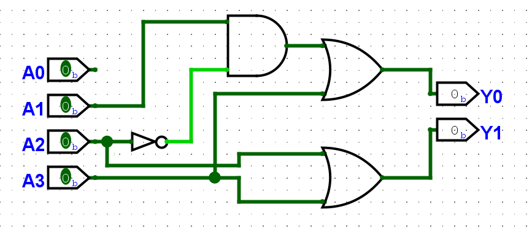

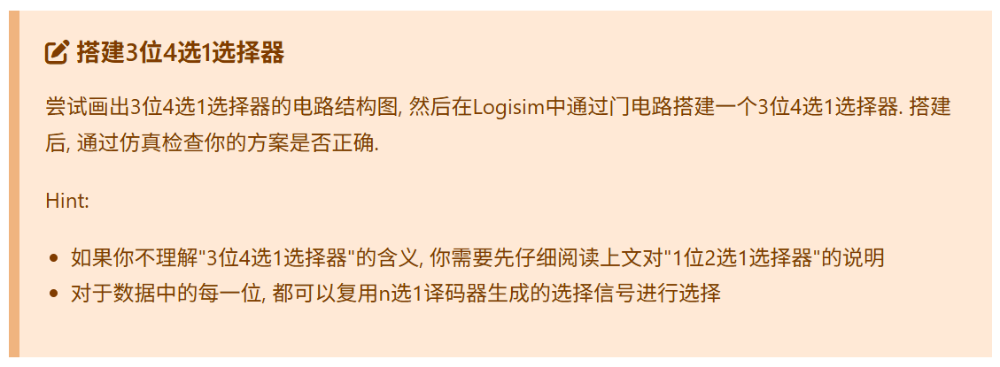

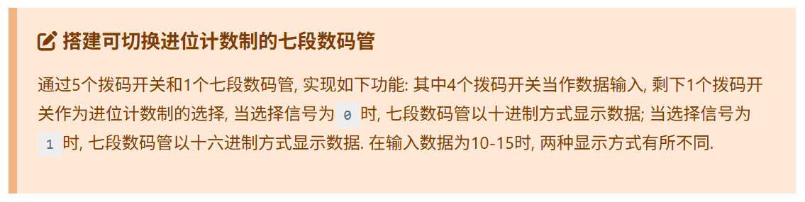

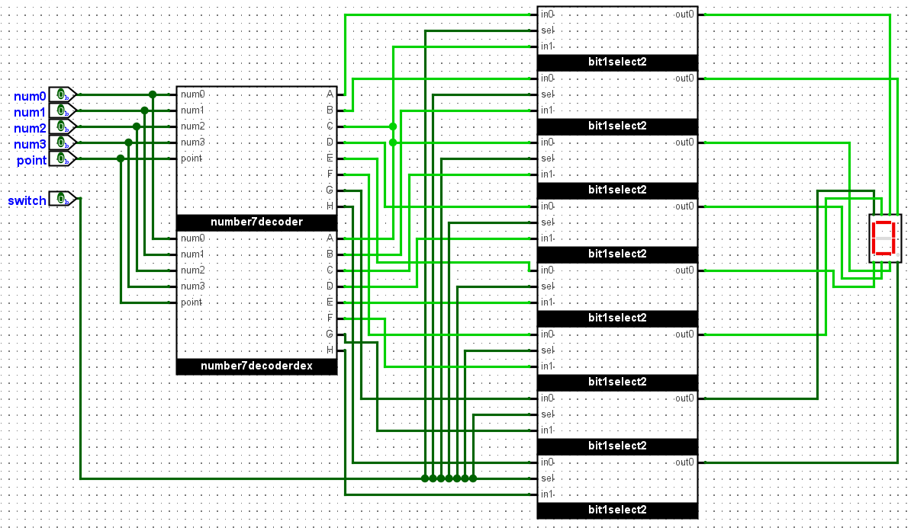

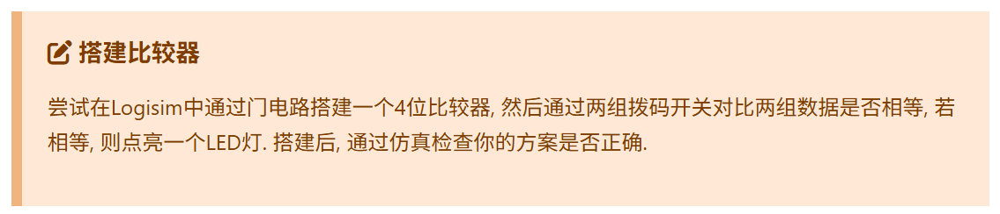

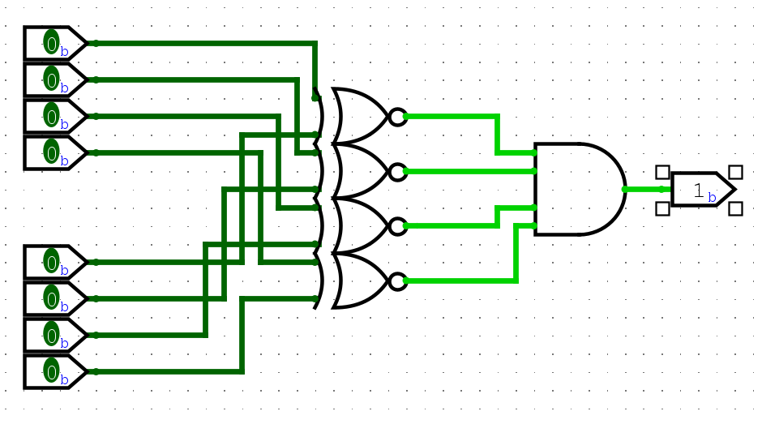

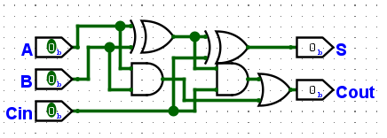

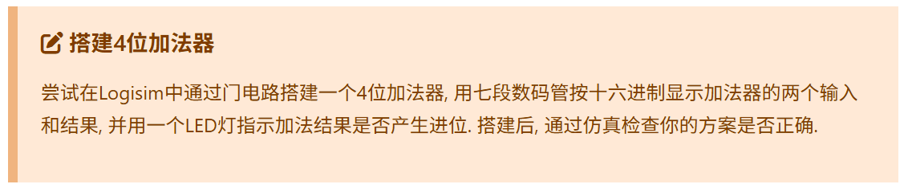

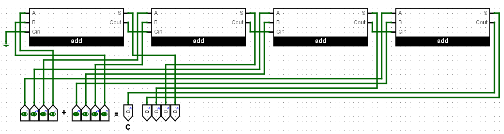

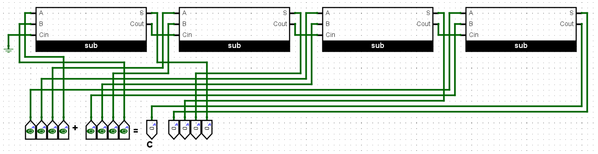

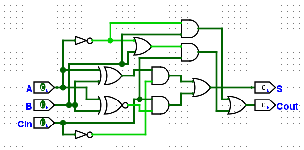

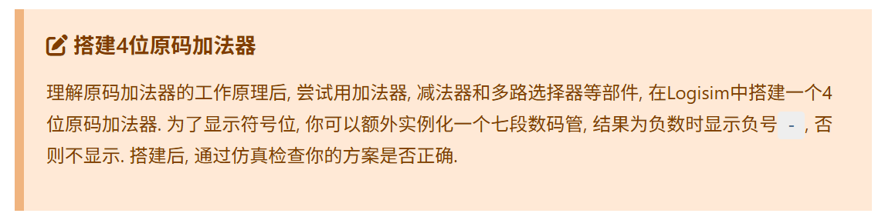  

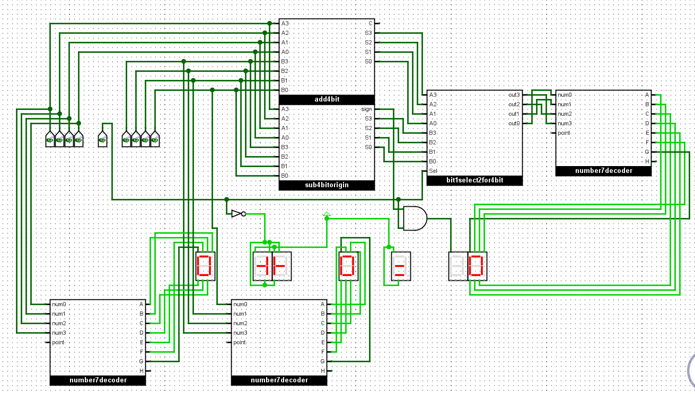

4位加减法器
  

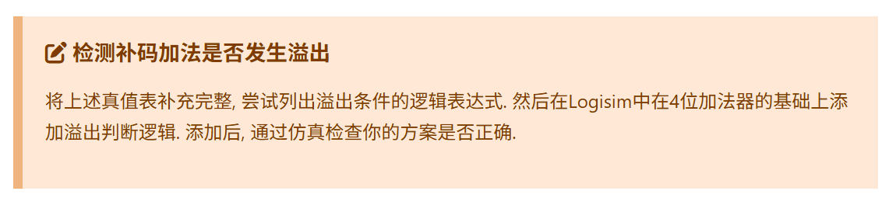

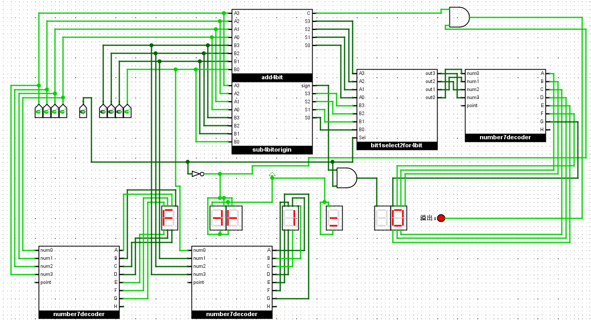

带溢出检测

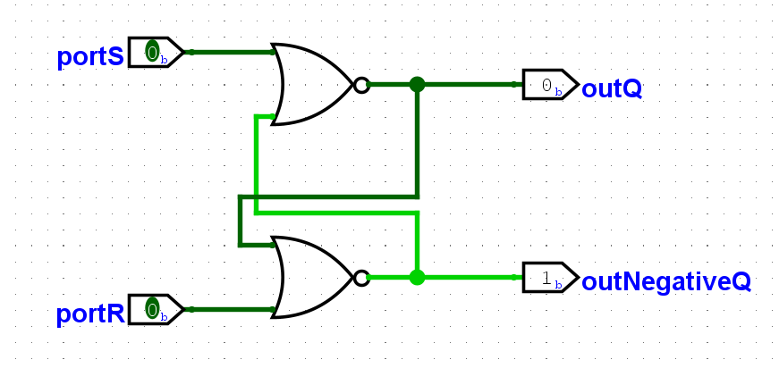

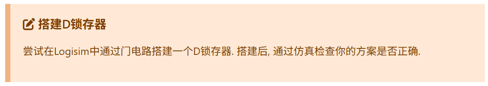

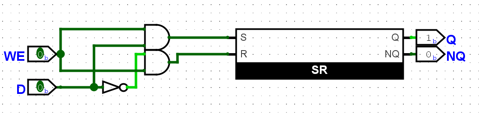

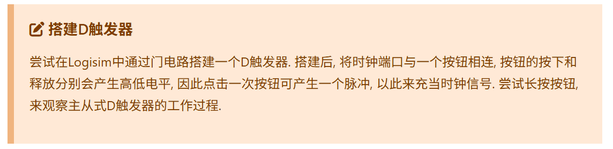

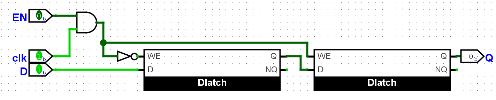

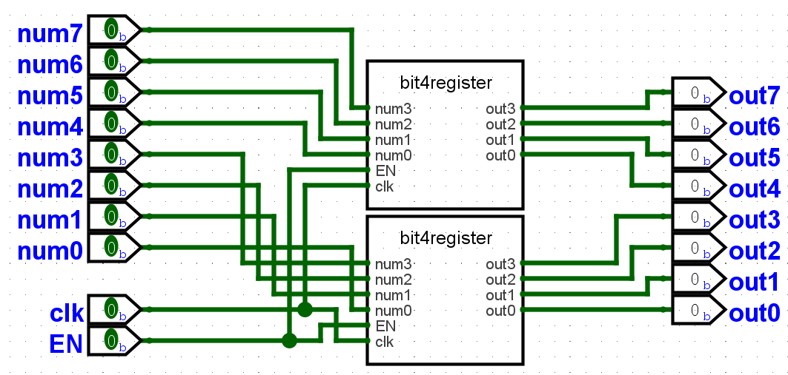

改成了八位

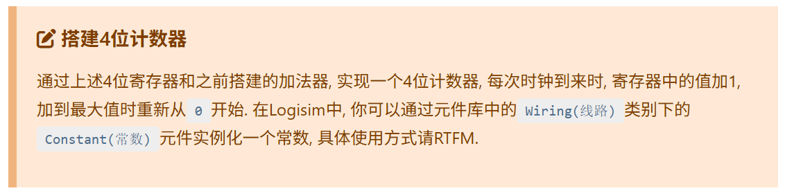

改成了8位

前11项和0+1+2+...+10=55（第一项为0）

